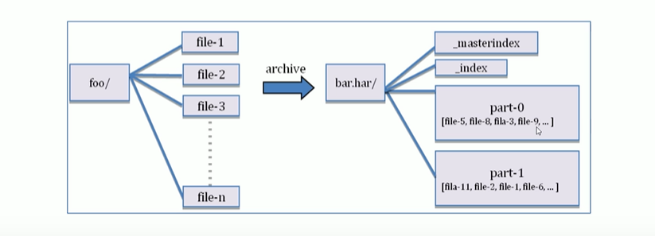

## HDFS 写数据流程
1. HDFS 客户端创建 FileSystem 对象实例 DistributedFileSystem，FileSystem 封装了与文件系统操作相关的方法。
2. 调用 DistributedFileSystem 的 create() 方法，通过 RPC 请求 NameNode 创建文件。
NameNode 执行各种检查判断：是否有权限，目标文件是否已经存在等。检查通过后 NameNode 就会为本次请求记下一条记录，返回 DFSDataOutputStream 
输出流对象给客户端用于写数据。
3. 客户端通过 FSDataOutputStream 开始写入数据
4. 客户端写入数据时，FSDataOutputStream 会将数据分成一个一个数据包（packet 默认 64k），并写入一个内部数据队列（data queue）。
DFSDataOutputStream 有一个内部类 DataStreamer，用于请求 NameNode 挑选出适合存储数据副本的一组 DataNode，默认是 3 副本存储。DataStreamer
将数据包流式传输到 Pipeline 的第一个 DataNode，该 DataNode 接收到数据之后再把数据发送到下一个 DataNode 中，直到 3 副本都接收到数据为止。
5. DFSDataOutputStream 也维护者一个内部数据包队列来等待 DataNode 的收到确认回执，称之为确认队列。收到 Pipeline 中所有 DataNode 确认信息后，
该数据包才会从确认队列删除。
6. 客户端完成数据写入后，在 DFSDataOutputStream 输出流上调用 close() 方法来关闭输出流。
7. DistributedFileSystem 联系 NameNode 告知其文件写入完成，等待 NameNode 确认。
因为 NameNode 已经知道文件由哪些块组成，因此仅需要等待最小复制块即可成功返回。最小复制数是由参数 dfs.namenode.replication.min 指定，默认为 1。
表示只要成功写入一个副本，NameNode 就会给客户端返回成功响应。

## NameNode 元数据管理
#### 元数据管理概述
在 HDFS 中，文件相关元数据有两种类型：
* 文件自身属性信息：文件名称，权限，修改时间，文件大小，复制因子，数据块大小。
* 文件块位置映射信息：记录文件块存储在哪个 DataNode 上。

按照存储形式区分，元数据分为存储在内存中的内存元数据和存储在磁盘上的元数据文件。其中元数据文件有两种：fsimage 内存镜像文件，Edits log 编辑日志。
* fsimage 内存镜像文件
fsimage 是内存元数据的一个持久化的检查点，相当于内存中文件自身属性元数据某一时刻的快照。 是由 DataNode 启动加入集群的时候，向 NameNode 
进行数据汇报的时候得到的，并且后续 DataNode 会定时进行汇报。

* Edits log 编辑日志
NameNode 会定期将内存中的文件自身属性元数据进行快照，持久化到磁盘的 fsimage 内存镜像文件中。当 NameNode 节点重启，那么内存中存储的文件自身属性信息元数据
就会部分丢失（仅能从磁盘的 fsimage 恢复部分数据），因此需要 Edits log 编辑日志。Edits log 编辑日志会记录所有的事务性操作（修改操作）。从 fsimage 中
恢复不了的数据，可以通过 Edits log 进行恢复。


#### HDFS format 操作
首次启动 HDFS 时需要进行 format 操作，这里的 format 并不是格式化的意思而是对 HDFS 进行初始化。包括：一些清理准备工作，创建元数据本地存储目录和
初始化元数据相关文件。

#### 元数据相关文件-VERSION
什么是 blockpool？  
blockpool 指的是属于某个 NameSpace 的一组 block。每一个 DataNode 中都含有所有的 blockpool。不同的 blockpool 中有属于各自 NameSpace 的
block。

* NameSpaceID：联邦集群下，不同的 NameNode 有它自己的 id
* clusterID：集群 id，一个集群下的所有 NameNode，DataNode 它们的集群 id 都是相同的
* blockpoolID：同一个 NameSpace 下的 block 他们的 blockpoolID 是相同的
* storageType：该节点类型
* cTime：NameNode 存储系统创建时间，首次格式化文件系统时这个属性值为 0，当文件系统升级后，该值会更新到升级之后的时间戳
* layoutVersion：HDFS 元数据格式的版本，HDFS 升级时会进行更新
* seen-txid：
    * 上一次 checkpoint（元数据合并）时的最后一个事务 id
    * NameNode 在启动时会检查 seen-txid 文件，以验证它至少可以加载该数目的事务。如果无法验证加载事务，NameNode 会中止启动


#### 查看 fsimage 和 edits log
oiv 可将 fsimage 文件的内容转化为可读形式：
> 常用命令：hdfs oiv -i fsimage_0000000000000050 -p XML -o fsimage.xml

oev 可查看 edits log 文件：
> 常用命令：hdfs oev -i edits_0000000000000050 -o edits.xml

## SecondaryNameNode
#### 背景
当 HDFS 集群运行一段时间后，就会出现以下问题：
1. edits log 文件越来越大
2. fsimage 距离上次持久化过了一段时间，导致文件不是最新的
3. NameNode 重启需要花费很长的时间，因为有很多的改动要从 edits log 合并到 fsimage 上（fsimage 不能频繁的持久化，因为很消耗性能）

#### SecondaryNameNode 职责
为了解决上述问题，使用 SecondaryNameNode 定期的把 edits log 合并到 fsimage 上。

#### Checkpoint 流程
1. 当触发 Checkpoint 操作条件时，SecondaryNameNode 发送请求给 NameNode。NameNode 会创建一个新的 edits log，后续的更改日志都会记录到新的 edits log。
2. SecondaryNameNode 会将 NameNode 上旧的 edits log 和 fsimage 复制到本地内存并进行合并，生成最新的 fsimage 并发送给 NameNode。
3. 等待下一次 Checkpoint

#### Checkpoint 触发机制
在 core-xml 中设置
> dfs.namenode.checkpoint.period=3600   
> 两次 checkpoint 之间的时间间隔。默认 1h
> 
> dfs.namenode.checkpoint.txns=100000  
> 即使没到到达上面配置的 checkpoint 时间点，当达到该事务数时，进行 checkpoint。默认 100 万事务数量

## NameNode 元数据恢复
#### NameNode 存储多目录
NameNode 元数据存储目录由参数 dfs.namenode.name.dir 指定。它可以配置多个目录，配置的各个目录结构和内容完全一样，相当于备份。这样的好处是当其中
一个目录损坏了，也不会影响到 NameNode 的元数据。特别是当其中一个目录是 NFS（网络文件系统），即使这台机器坏了，元数据也能够安全保存。

#### NameNode 存储多目录
SecondaryNameNode 在 checkpoint 时会将 NameNode 的 edits log 和 fsimage 保存到本地，并且在 checkpoint 之后也不会删除。

#### 主备 NameNode/NameNode 集群

## HDFS 小文件解决方案
#### Archive 文件归档
###### 背景
HDFS 并不擅长存储小文件，因为每个文件最少一个 block（默认 128mb），每个 block 的元数据都会存储在 NameNode 占用内存。如果存在大量的小文件，
它们会吃掉 NameNode 中的大量内存。即小文件占大内存。

###### Archive 文件归档
Archive 能够有效解决上述问题，它可以把多个小文件归档成一个文件，归档后依旧可以访问每一个文件


注意：Archive 归档是通过 MapReduce 程序完成的，所以需要启动 YARN 集群

* 创建 Archive
> hadoop archive -archiveName name -p <parent> <src>* <dest>
> * archiveName：指定归档的文件名称（带.har扩展名）
> * -p：指定一个或多个待归档目录的（共同）父目录
> * <src>：指定一个或多个待归档的目录，注意：这里实际填写的是相对上面父目录的相对路径
> * <dest>：指定归档文件的存放路径

* 查看 Archive test.har 由哪些文件组成
> har:///hdfs-hostname:port/archivepath/fileinarchive

* 提取 Archive
> 按顺序解压存档（串行）
> hadoop fs =cp har:///outputdir/test.har/* /smallfile
> 
> 并行解压存档
> hadoop distcp har:///outputdir/test.har/* /smallfile

#### Sequence File 序列化文件
#### Sequence File 介绍
Sequence File 是 Hadoop 提供的一种二进制文件存储格式。Sequence File 中一条数据称为 record，底层以<key,value>键值对形式
序列化到文件中。

 
#### Sequence File 优缺点
优点：
1. 二进制格式存储，比文本文件更加紧凑
2. 支持不同级别的压缩（基于 record 压缩（压缩一条数据），基于 block 压缩(压缩整个 block)）
3. 可以对 Sequence File 文件进行拆分和并行处理，适用于 MapReduce 程序

局限性:
1. 二进制文件查看不方便
2. 只能用于 java API 操作

#### Sequence File 读写文件 Demo
```java
package org.example.sequenceFile;

import org.apache.hadoop.conf.Configuration;
import org.apache.hadoop.fs.Path;
import org.apache.hadoop.io.IOUtils;
import org.apache.hadoop.io.IntWritable;
import org.apache.hadoop.io.SequenceFile;
import org.apache.hadoop.io.Text;
import org.apache.hadoop.io.compress.CompressionCodec;
import org.apache.hadoop.io.compress.GzipCodec;

import java.io.IOException;

public class SequenceFileWrite {
    private static final String[] DATA = {
            "a,b,c,d",
            "1,2,3,4",
            "bob,ted,barney,lee"
    };

    public static void main(String[] args) {
        //设置客户端身份，便于在 HDFS 上有权限操作文件
        System.setProperty("HADOOP_USER_NAME", "root");
        //用于指定相关参数
        Configuration configuration = new Configuration();
        //Sequence File key and value
        IntWritable key = new IntWritable();
        Text value = new Text();

        //构造 Writer 参数属性
        SequenceFile.Writer writer = null;
        CompressionCodec codec = new GzipCodec();

        SequenceFile.Writer.Option optPath = SequenceFile.Writer.file(new Path("hdfs://10.169.82.75:8020/seq.out"));
        SequenceFile.Writer.Option optKey = SequenceFile.Writer.keyClass(key.getClass());
        SequenceFile.Writer.Option optVal = SequenceFile.Writer.valueClass(value.getClass());
        SequenceFile.Writer.Option optCom = SequenceFile.Writer.compression(SequenceFile.CompressionType.RECORD, codec);

        try {
            writer = SequenceFile.createWriter(configuration, optPath, optKey, optVal, optCom);

            for (int i = 0; i < 100; i++) {
                key.set(100 - i);
                value.set(DATA[i%DATA.length]);
                System.out.printf("[%s]\t%s\t%s\n",writer.getLength(), key, value);
                writer.append(key, value);
            }

        }catch (Exception e) {{
            try {
                writer.close();
            } catch (IOException ex) {
                throw new RuntimeException(ex);
            }
        }}
    }
}
```

```java
package org.example.sequenceFile;

import org.apache.hadoop.conf.Configuration;
import org.apache.hadoop.fs.Path;
import org.apache.hadoop.io.SequenceFile;
import org.apache.hadoop.io.Writable;
import org.apache.hadoop.util.ReflectionUtils;

import java.io.IOException;

public class SequenceFileRead {
  public static void main(String[] args) {
    //设置客户端身份，便于在 HDFS 上有权限操作文件
    System.setProperty("HADOOP_USER_NAME", "root");
    //用于指定相关参数
    Configuration configuration = new Configuration();

    SequenceFile.Reader.Option option1 = SequenceFile.Reader.file(new Path("hdfs://10.169.82.75:8020/seq.out"));
    // 指定要读取的字节数
    SequenceFile.Reader.Option option2 = SequenceFile.Reader.length(1024);

    SequenceFile.Reader reader = null;
    try {
      reader = new SequenceFile.Reader(configuration, option1, option2);
      Writable key = (Writable) ReflectionUtils.newInstance(reader.getKeyClass(), configuration);
      Writable value = (Writable) ReflectionUtils.newInstance(reader.getValueClass(), configuration);
      long position = reader.getPosition();

      while (reader.next(key, value)) {
        String syncSeen = reader.syncSeen()?"*":"";
        System.out.printf("[%s%s]\t%s\t%s\n",position, syncSeen, key, value);
      }


    }catch (Exception e) {
      try {
        reader.close();
      } catch (IOException ex) {
        throw new RuntimeException(ex);
      }
    }
  }
}
```

