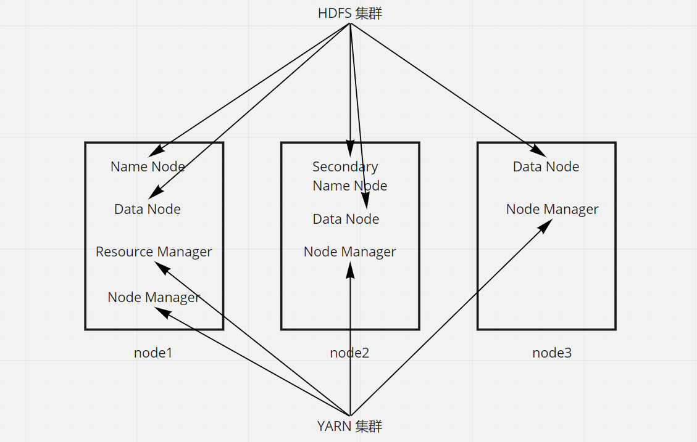

## Hadoop 集群搭建

#### Hadoop 集群简介
Hadoop 集群包含 HDFS（Name Node，Secondary Name Node，Data Node） 集群和 Yarn 集群（Resource Manager，Node Manager）。
下图显示的是包含 3 个节点的 Hadoop 集群。
  

  
#### Hadoop 部署模式
Hadoop 部署模式包含下列 4 种：
* 单机模式：1 个机器运行 1 个 java 进程，所有角色在一个进程种运行。主要用于调试
* 伪分布式：1 个机器运行多个进程，每个角色一个进程。主要用于调试
* 集群模式：多个服务器构成 Hadoop 集群，主节点和从节点会分开部署在不同机器上。用于生产环境
* 集群模式：在集群模式的基础上，为单点故障部署备份角色，形成主备架构，实现容错

#### Hadoop 源码编译
生产环境建议本地编译 hadoop 源码  
原因：Hadoop是使用Java语言开发的，但是有一些需求和操作并不适合使用java,所以就引入了本地库(Native Libraries) 的概念。
说白了，就是Hadoop的某些功能，必须通过JNT来协调Java类文件和Native代码生成的库文件一起才能工作。linux系统要运行Native 代码，
首先要将Native 编译成目标CPU 架构的[.so]文件。而不同的处理器架构，需要编译出相应平台的动态库[.so] 文件，才能被正确的执行，
所以最好重新编译一次hadoop源码，让[.so]文件与自己处理器相对应。

#### Hadoop 集群安装
##### step1 集群角色规划
* 角色规划准则  
根据角色特点和服务器特点合理分配资源，如 NameNode 依赖内存故应该部署到大内存的机器上

* 角色规划注意事项  
资源上有抢夺冲突的，尽量不要部署在一起  
工作上需要相互配合的，尽量部署到一起  

|  服务器   | 角色  |
|  ----  | ----  |
| node1  | Name Node，Data Node，Resource Manager，Node Manager |
| node2  | Secondary Name Node，Data Node，Node Manager |
| node3  | Data Node，Node Manager |

##### step2 服务器基础环境准备
* 设置主机名  
`/vim etc/hostname`  

```shell script  
node1.jiexi
```

* 查看当前主机名称
`hostname`  

* 配置 host 映射关系  
`vim /etc/hosts`  

```shell script  
127.0.0.1   localhost localhost.localdomain localhost4 localhost4.localdomain4
::1         localhost localhost.localdomain localhost6 localhost6.localdomain6

10.146.100.28 node1 node1.jiexi
10.146.100.29 node2 node2.zhoupeng
10.146.100.11 node3 node3.yangzhen
```

* 配置 host 生效  
`service network restart` 或 `hostnamectl set-hostname node2.zhoupeng`

* 关闭防火墙  
`systemctl stop firewalld.service`  

* 禁止防火墙开机启动  
`systemctl disable firewalld.service` 

* 设置 SSH 免密登录
node1 需要对 node1，node2，node3 实现免密登录
先执行`ssh-keygen`生产密钥，再执行 `ssh-copy-id` 命令可以把本地主机的公钥复制到远程主机的 `authorized_keys` 文件上，
ssh-copy-id node1，ssh-copy-id node2，ssh-copy-id node3

* 集群时间同步
`yum -y install ntpdate`
`ntpdate ntp4.aliyun.com`

* 安装 JDK  
```shell script 
JAVA_HOME=/opt/jdk1.8.0_202
PATH=$PATH:$JAVA_HOME/bin
CLASSPATH=.:$JAVA_HOME/lib/dt.jar:$JAVA_HOME/lib/tools.jar
export JAVA_HOME CLASSPATH PATH
```

##### step3 配置目录结构
* 创建统一工作目录
软件安装目录：`mkdir -p /export/server/`
数据存储目录：`mkdir -p /export/data/`
安装包存放目录：`mkdir -p /export/software/`

##### step4 编辑 Hadoop 配置文件  
* 修改 hadoop-env.sh（hadoop/etc/hadoop/）  

```shell script 
#配置 JAVA_HOME
export JAVA_HOME=/export/server/jdk1.8.0_65

#设置用户，确定执行 shell 命令的角色 
export HDFS_NAMENODE_USER="root"
export HDFS_DATANODE_USER="root"
export HDFS_SECONDARYNAMENODE_USER="root"
export YARN_RESOURCEMANAGER_USER="root"
export YARN_NODEMANAGER_USER="root"
```

* 修改 core-site.xml（hadoop/etc/hadoop/）  
```xml
<configuration>
    <!--name 表示选择的文件系统。file:/// 为本地文件系统；fs.defaultFS 为 HDFS 默认文件系统-->
    <!--value 表示文件系统访问地址-->
    <property>
        <name>fs.defaultFS</name>
        <value>hdfs://node1.jiexi:8020</value>
    </property>
    <!--HDFS 本地数据存放目录，format 时自动生成-->
    <property>
        <name>hadoop.tmp.dir</name>
        <value>/export/data/hadoop-3.3.1</value>
    </property>
    <!--在 Web UI 页面访问 HDFS 的用户名-->
    <property>
        <name>hadoop.http.staticuser.user</name>
        <value>root</value>
    </property>
</configuration>

```

* 修改 hdfs-site.xml（hadoop/etc/hadoop/）  
```xml
<configuration>
    <!--指定 Secondary Name Node 运行主机和端口-->
    <property>
        <name>dfs.namenode.secondary.http-address</name>
        <value>node2.zhoupeng:9868</value>
    </property>
</configuration>

```

* 修改 mapred-site.xml（hadoop/etc/hadoop/）  
```xml
<configuration>
    <!--MapReduce 程序运行方式，yarn 集群模式还是 local 本地模式-->
    <property>
        <name>mapreduce.framework.name</name>
        <value>yarn</value>
     </property>
    <!--MapReduce 程序 Master 环境交量-->
    <property>
        <name>yarn.app.mapreduce.am.env</name>
        <value>HADOOP_MAPRED_HOME=${HADOOP_HOME}</value>
    </property>
        <!--MapReduce 程序 MapTask 环境变量-->
    <property>
        <name>mapreduce.map.env</name>
        <value>HADOOP_MAPRED_HOME=${HADOOP_HOME}</value>
    </property>
        <!--MapReduce 程序 Reduce Task 环境变量-->
    <property>
        <name>mapreduce.reduce.env</name>
        <value>HADOOP_MAPRED_HOME=${HADOOP_HOME}</value>
    </property>
</configuration>
```

* 修改 yarn-site.xml（hadoop/etc/hadoop/）  
```xml
<configuration>
    <!--yarn 集群 Resource Manager 运行的机器-->
    <property>
        <name>yarn.resourcemanager.hostname</name>
        <value>node1.jiexi</value>
    </property>
    <!--NodeManager 上运行的附属服务，需配置成 mapreduce shuffle 才可运行 MapReduce 程序-->
    <property>
        <name>yarn.nodemanager.aux-services</name>
        <value>mapreduce_shuffle</value>
    </property>
    <!-- 每个容器请求的最小内存资源（单位mb） -->
    <property>
        <name>yarn.scheduler.minimum-allocation-mb</name>
        <value>512</value>
    </property>
    <!-- 每个容器请求的最大内存资源（单位mb） -->
    <property>
        <name>yarn.scheduler.maximum-allocation-mb</name>
        <value>2048</value>
    </property>
    <!-- 容器虚拟内存与物理内存之间的比例 -->
    <property>
        <name>yarn.nodemanager.vmem-pmem-radio</name>
        <value>4</value>
    </property>
</configuration>
```

* 编辑 workers（hadoop/etc/hadoop/）  
```shell script
node1.jiexi
node2.zhoupeng
node3.yangzhen
```

* 将 node1 的 Hadoop 安装包分发到所有节点种
```shell script
scp -r hadoop-3.1.4 root@node2:/export/server/
scp -r hadoop-3.1.4 root@node3:/export/server/
```

##### step5 hadoop 和 java 环境变量配置
1. 配置环境变量
```
JAVA_HOME=/export/server/jdk1.8.0_202
PATH=$PATH:$JAVA_HOME/bin
CLASSPATH=.:$JAVA_HOME/lib/dt.jar:$JAVA_HOME/lib/tools.jar
export JAVA_HOME CLASSPATH PATH
export HADOOP_HOME=/export/server/hadoop-3.3.1
export PATH=$PATH:$HADOOP_HOME/bin:$HADOOP_HOME/sbin
```

2. 将配置好的文件发送到其它节点上
`scp /etc/profile root@node2:/etc/`

3. 重新加载环境变量
`source /etc/profile`

执行`hadoop`命令查看环境变量是否生效

##### step6 NameNode format（格式化 NameNode）
* 首次启动 HDFS 时，必须对其进行格式化操作
`hdfs namenode -format`

* 备注：format 只能进行一次，若多次操作除了会造成数据丢失外，还会导致 hdfs 集群主从角色互不识别
通过删除所有机器的 hadoop.tmp.dir 目录重新 format 可解决

## Hadoop 集群启停
##### 单进程启停
* 在集群中的某台机器上手动启停一个角色的进程
* HDFS 集群
`hdfs --daemon start namenode|datanode|secondarynamenode`
`hdfs --daemon stop namenode|datanode|secondarynamenode`
* YARN 集群
`yarn --daemon start resourcemanager|nodemanager`
`yarn --daemon stop resourcemanager|nodemanager`

##### 集群一键启停
前提：集群节点直接配置好 ssh 免密登录和 workers 文件
* HDFS 集群：`start-dfs.sh`，`stop-dfs.sh`
* YARN 集群：`start-yarn.sh`，`stop-yarn.sh`
* Hadoop 集群：`start-all.sh`，`stop-all.sh`

##### Hadoop 启动日志
* /export/server/hadoop-3.1.4/logs

## Hadoop Web UI 页面
* HDFS 集群管理页面：http://namenode_host:9870
* YARN 集群管理页面：http://resource_manager_host:8088

## win 系统开发环境配置
* 场景： 使用 java 代码操作 HDFS
* 提示：找不到 winutils.exe，HADOOP_HOME 没有配置
* 原因：
  1. Hadoop 访问 windows 本地文件系统，要求 windows 上的本地库能够正常工作。
  2. 其中，Hadoop 使用某些 windows API 来实现类似 posix 的文件访问权限
  上述功能需要在 hadoop.dll 和 winutils.exe 来实现