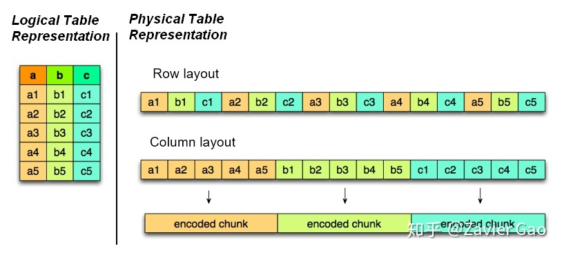
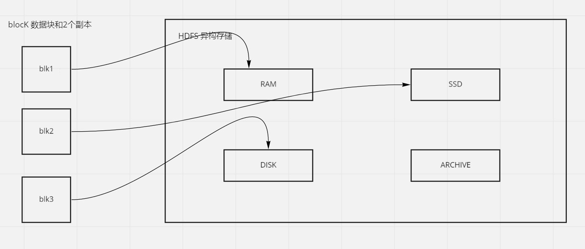
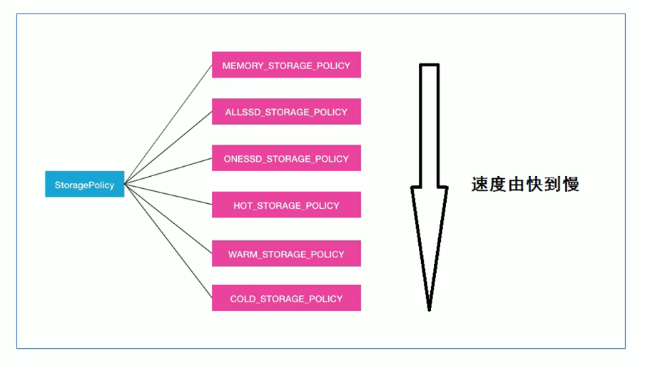

## HDFS 分布式文件系统  
#### 简介  
HDFS（Hadoop Distributed File System），意为 Hadoop 分布式文件系统。是 Apache Hadoop 核心组件之一，作为大数据生态圈
最底层的分布式存储服务而存在。

#### HDFS 设计目标
* 硬件故障 (Hardware Failure〕是常态，HDFS 可能由成百上千的服务器组成每一个组件都有可能出现故障．因此故阵检测
和自动快速恢复是 HDFS 的核心架构目标。
* HDFS 上的应用主要是以流式读取数据 （Streaming Data Access）。 HDFS 被设计成用于批处理，而不是用户交互式
的。相较于数据访问的反应时间，更注重数据访问的高吞吐量
* 典型的 HDFS 文件大小是 GB 到 TB 的级别。所以，HDFS被调整成支持大文件 ( Large Data Sets )。它应该提供很高的
聚合数据带宽，一个集群中支持数百个节点，一个集群中还应该支持千万级别的文件。
* 大部分 HDFS 应用对文件要求的是 write-one-read-many 访问模型。一个文件一旦创建，写入，关闭之后就不需要修
改了。这一假设简化了数据一致性问题，使高吞吐量的数据访问成为可能。

#### HDFS 应用场景
适用场景：
* 大文件
* 数据流式访问
* 一次写入多次读取
* 低成本，廉价服务器
* 高容错

不适合场景：
* 小文件
* 数据交互式访问
* 频繁，任意修改数据
* 低延迟处理

#### HDFS 重要特性
###### 主从架构
* HDFS 采用 master/slave 架构。一般一个 HDFS 集群有一个 NameNode 和一定数目的 DataNode 组成。NameNode 是主节点，
DataNode 是从节点，两种角色各司其职，共同协调完成分布式文件存储服务

###### 分块存储机制
* HDFS 中的文件在物理上是分块存储的，块的大小可以通过配置参数来决定，参数位于 hdfs-default.xml 中：dfs.blocksize。
默认大小是 128M。（不足 128M 不分块）

###### 副本机制
* 文件的所有 block 都会有副本，每个文件的 block 大小（dfs.blocksize）和副本系数（dfs.replication）都是可配置的。
副本系数可以在创建文件时指定，也可以之后通过命令改变。
* 默认 dfs.replication 的值是 3，也就是会额外再复制 2 份，连同本身总共 3 份副本

###### namespace
* HDFS 支持传统的层次型文件组织结构。用户可以创建目录，然后将文件保存在这些目录里，文件系統名字空间的层
次结构和大多数现有的文件系统类似：用户可以创建，珊除、移动或重命名文件。
* NameNode 负责维护文件系统的 namespace 名称空间，任何对文件系统名称空间或属性的修改都将被 NameNode 记录下
来。
* HDFS会给容户端提供一个统一地抽象目录树．客户端通过路径来访问文件

###### 元数据管理
在 HDFS 中，NameNode 管理的元数据有两种类型
* 文件自身属性：文件名称，权限，修改时间，文件大小，复制因子，数据块大小
* 文件块位置映射信息：记录文件块和 DataNode 之间的映射信息，即哪个块位于哪个节点上    

###### 数据块存储
* 文件的各个 block 由 DataNode 存储。每一个 block 及其副本可以在多个 DataNode 中存储

## HDFS Java 客户端

```java
package org.example;

import org.apache.hadoop.conf.Configuration;
import org.apache.hadoop.fs.FileSystem;
import org.apache.hadoop.fs.Path;
import org.apache.log4j.Logger;
import org.junit.After;
import org.junit.Before;
import org.junit.Test;

import java.io.IOException;

/**
 * @author w97766
 * @date 2021/12/6
 */
public class HDFSClientTest {
    private static Configuration configuration;
    private static FileSystem fileSystem;
    Logger logger = Logger.getLogger(HDFSClientTest.class);

    @Before
    public void connectHDFS() throws IOException {
        //设置客户端身份，便于在 HDFS 上有权限操作文件
        System.setProperty("HADOOP_USER_NAME", "root");

        configuration = new Configuration();
        //设置操作的文件系统是 HDFS，并指定 HDFS 的操作地址
        configuration.set("fs.defaultFS", "hdfs://node1.jiexi:8020");
        fileSystem = FileSystem.get(configuration);
    }

    @After
    public void close() {
        try {
            if (null != fileSystem) {
                fileSystem.close();
            }
        } catch (IOException e) {
            e.printStackTrace();
        }
    }

    /**
     * 创建目录
     * @throws IOException
     */
    @Test
    public void mkdir() throws IOException {
        Path path = new Path("/barney");
        if (!fileSystem.exists(path)) {
            fileSystem.mkdirs(path);
        }
    }

    /**
     * 上传文件
     * @throws IOException
     */
    @Test
    public void upload() throws IOException {
        Path src = new Path("C:\\lol.txt");
        Path dst = new Path("/barney");
        fileSystem.copyFromLocalFile(src, dst);
    }

    /**
     * 下载文件
     * @throws IOException
     */
    @Test
    public void download() throws IOException {
        Path src = new Path("/barney/lol.txt");
        Path dst = new Path("C:\\lol.txt");
        fileSystem.copyToLocalFile(src, dst);
        logger.info("test");
    }
}

```

```text
    <dependency>
      <groupId>org.apache.hadoop</groupId>
      <artifactId>hadoop-hdfs</artifactId>
      <version>3.1.4</version>
    </dependency>

    <dependency>
      <groupId>org.apache.hadoop</groupId>
      <artifactId>hadoop-client</artifactId>
      <version>3.1.4</version>
    </dependency>

    <dependency>
      <groupId>org.apache.mrunit</groupId>
      <artifactId>mrunit</artifactId>
      <version>1.1.0</version>
      <classifier>hadoop2</classifier>
      <scope>test</scope>
    </dependency>
```

## HDFS Shell 命令
>hadoop fs -mkdir [-p] <path>
>* -p：递归创建目录

>hadoop fs -ls [-h] [-R] [<path>]
>* -h 显示文件大小
>* -R 递归查看子目录

>上传文件到指定目录
>hadoop fs -put [-f] [-p] <localsrc> <dst>
>* -f：覆盖目标文件
>* -p：保留访问和修改时间
>* localsrc：本地文件系统
>* dst：目标文件系统

>hadoop fs -remove [-f] [-p] <localsrc> <dst>
>* 和 -pu 功能相似，但是上传结束后，源文件会被删除

>hadoop fs -cat <src>
>* 读取指定文件的全部内容，输出在控制台。大文件慎用

>hadoop fs -head <src>
>* 查看文件前1KB的内容

>查看文件后 1KB 的内容：
>hadoop fs -tail [-f] <src> 
>* -f:动态显示文件追加的内容

>下载文件到本地系统指定目录：
>hadoop fs -get [-f] [-p] <src> <localdst>
>* -f:若存在则覆盖
>* -p:保留访问和修改时间

>下载多个文件合并到本地系统的一个文件中：
>hadoop fs -getmerge [-nl] [-skip] [-skip-empty-file] <src> <localdst>
>* -nl：表示每个文件末尾添加换行符

>复制 HDFS 文件：
>hadoop fs -cp [-f] <src> <localdst>
>* -f:若存在则覆盖

>移动 HDFS 文件：
>hadoop fs -mv <src> <localdst>

>追加数据到 HDFS 文件, 将所有给定本地文件的内容追加到给定的dst文件中
>dst不存在则创建该文件：
>hadoop fs -appendToFile <localdst> <dst>

>查看HDFS磁盘空间：
>hadoop fs -df <path>

>查看HDFS文件使用的空间  
>hadoop fs -du [-s] [-h] <path>
>* -s:显示指定路径文件长度的汇总摘要
>* -h：以人类可读方式格式化文件大小

>修改指定文件的副本个数
>hadoop fs -setrep [-R] [-w] <rep> <path>
>* -R 表示递归，修改文件夹下及所有
>* -w 客户端是否等待副本修改完毕

## HDFS REST 客户端
#### WebHDFS 概述
* WebHDFS 提供了访问 HDFS 的 RESTful 接口，是 HDFS 内置组件，默认开启 

#### HttpFS 概述
* HttpFS 是一个提供 RESTful 接口的网关的服务器，该网关支持所有的 HDFS 文件系统操作
* 对于文件的 CURD 操作全部提交给 HttpFS 进行中转，然后由 HttpFS 去和 HDFS 集群交互
* HttpFS 是一个独立于 HDFS 之外的服务，需要手动安装开启

## HDFS 文件存储格式
#### 行式存储，列式存储


特点|行式存储|列式存储
--|:--:|--:
含义|数据按行存储，将数据以行为单位存储到磁盘上（如上图 Row layout）|数据按列存储，将数据以列为单位，存储到磁盘上（如上图 Column layout）
插入数据时|行式存储将要插入的一行数据追加到磁盘上，执行一次插入操作|将数据按列划分分别插入到不同列中，执行多次插入操作
读取数据时|先读取所有数据，在过滤掉不需要的列，读取时会产生冗余数据|读取符合条件的数据，不产生冗余数据
特点|适合插入，不适合读取|适合读取，不适合插入

#### OLTP 与 OLAP
OLTP（on-line transaction processing）翻译为联机事务处理， OLAP（On-Line Analytical Processing）翻译为联机分析处理，
从字面上来看OLTP是做事务处理，OLAP是做分析处理。从对数据库操作来看，OLTP主要是对数据的增删改，OLAP是对数据的查询。

#### 文件存储格式
1. Text File
* 文本格式是 Hadoop 最常见的数据格式，通常按行存储，以回车换行符区分不同行数据
* 最大的区别是。它不支持块级别压缩（多行数据一起压缩），因此在进行压缩时会带来较高的读取成本
* 解析开销一般比二进制格式高，尤其是 XML，JSON，他们的解析开销比 Text file 还要打
* 易读性好

2. Sequence File
* Sequence File，每条数据记录都是以 key，value 键值对进行序列化存储（二进制格式）
* 序列化文件与文本文件相比更紧凑，支持 record 级（一条数据压缩），block 块级压缩。压缩的同时支持文件切分
* 通常把 Sequence File 作为中间数据存储格式。例如：将大量小文件合并放入到一个 Sequence File 中

3. Avro File
* Avro File 是与语言无关的序列化系统，是一种列式内存数据结构
* Avro File 是基于行的存储格式，它在每个文件中都包含 JSON 格式的 schema 定义。除了支持可切分外，还支持块压缩
* Avro File 是一种自描述格式，它将数据的 schema 直接编码到文件中，可以用来存储复杂结构的数据
* Avro File 直接将一行数据序列化到一个 block 中
* 适用于大量频繁写入宽表数据（字段多列多）的场景，其序列化和反序列化很快

4. RC File
* Hive Record Columnar File 这种类型的文件首先将多条数据按行划分为行组，然后在行组内部将数据按列存储，
  很适合在数仓中执行分析，且支持压缩，切分
* 但不支持 schema 扩展，如果要添加新的列，则必须重写文件，这会降低操作效率

5. OCR File（升级版 OCR File）
* OCR File（Optimized Row Columnar）提供了比 RC File 更有效的文件格式。它在内部将数据划分为
默认大小为 250M 的 Stripe。每个条带均包含索引，数据和页脚。索引存储每列的最大值和最小值以及列中每一行的位置
* 它并不是一个单纯的列式存储格式，仍然是首先根据 Stripe 分割整个表，在每一个 Stripe 内进行按列存储
* ORC 有多种文件压缩方式，并且有着很高的压缩比。文件是可切分的
* ORC 文件是以二进制方式存储的，所以是不可直接读取的

6. Parquet
* Parquet 的存储模型主要由行组（Row Group），列块（Column Chuck），页（Page）组成
* 在水平方向上将数据划分为行组，默认行组大小与 HDFS Block 块大小对其，Parquet 保证一个行组会被
一个 Mapper 处理。行组中每一列保存在一个列块中，一个列块具有相同的数据类型，不同列块可以使用不同的压缩。
Parquet 是页存储方式，每一个列块包含多少个页，一个页是最小的编码单位，同一列块的不同页可以使用不同的编码方式


## HDFS 异构存储
#### 异构数据存储类型
* 冷，热，温，冻数据
   根据数据的使用频率来对数据进行划分，新导入的数据一般会被经常使用标记为“热数据”，存储的数据每周访问几次标记为“温数据”，
几个月或几周访问一次为“冷数据”，很少会被使用的数据为“冻数据”
   Hadoop 允许将不是热数据或活跃数据的数据分配到比较便宜的存储上，用于归档或冷存储。可以设置存储策略将旧数据从昂贵且高性能的
机器转移到低性能廉价的机器上

#### 异构存储
根据数据的特性（冷，热，温）将不同的数据存储到不同的存储介质中

#### 异构存储类型
HDFS 中定义了 4 种异构存储类型
* RAM_DISK（内存）
* SSD（固态硬盘）
* DISK（机械硬盘）
* ARCHIVE（高密度存储介质，存储历史数据）

#### 如何让 HDFS 知道集群中的数据存储目录是哪种存储介质
需要配置时主动声明，HDFS 没有检测能力

#### 块存储类型选择策略
块存储类型选择策略含义如下图，指的是对 HDFS 文件数据块副本使用哪些存储类型进行存储

* 块存储指的是对 HDFS 文件数据块副本存储
* HDFS（BlockStoragePolicySuite） 定义了 6 种块存储策略  
  HOT（默认策略）：用于存储和计算，所有副本存储在 DISK 中  
  COLD：适用于计算量有限的存储，不再使用的数据或需要归档的数据从热存储移动到冷存储，所有副本存储到 ARCHIVE 中  
  WARM：部分冷数据和部分热数据，热时，默些副本存储在 DISK 中，其余副本存储在 ARCHIVE 中  
  ALL_SSD：所有副本存储在 SSD 中  
  ONE_SSD：数据块的其中一个副本存储在 SSD 中，其余副本存储在 DISK 中  
  LAZY_PERSIST：数据块的其中一个副本存储在内存中，其余副本存储在 DISK 中  

* 前三种根据数据冷热区分，后三种根据磁盘性质区分

#### 块存储类型选择策略速度

