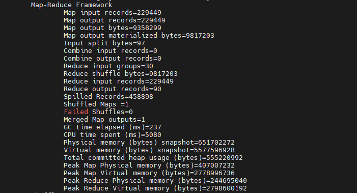
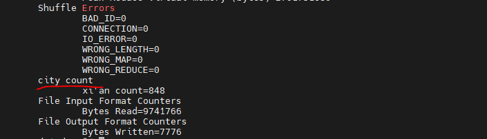

## 计数器
#### 概述
Hadoop 内置的计数器可以收集，统计程序运行中的核心数据，帮助用户理解程序运行情况，辅助用户诊断故障。如下图所示： 

Map 阶段输入了 229449 条记录，输出了 229449 条记录。


#### 内置计数器
Hadoop 内置的计数器都是全局计数器，统计的是集群系统的全集数据。

内置的计数器有：
* MapReduce 任务计数器
* 文件系统计数器
* 作业计数器
* 输入文件任务计数器
* 输出文件计数器

#### 自定义计数器

如下所示，计算文件中包含`西安市`三个字的次数。
```java
public class CovidMapper extends Mapper<LongWritable, Text, CovidBean, LongWritable> {
    CovidBean covidBean = new CovidBean();
    LongWritable longWritable = new LongWritable();

    @Override
    protected void map(LongWritable key, Text value, Mapper<LongWritable, Text, CovidBean, LongWritable>.Context context) throws IOException, InterruptedException {
        String[] words = value.toString().split(",");
        covidBean.setProvince(words[1]);
        covidBean.setCity(words[2]);
        covidBean.setDiagnosedNum(Long.parseLong(words[3]));

        longWritable.set(Long.parseLong(words[3]));

        Counter counter = context.getCounter("city count", "xi'an count");
        if ("西安市".equals(covidBean.getCity())) {
            counter.increment(1);
        }

        context.write(covidBean, longWritable);
    }
}

```



## 读写 mysql 操作
#### 读写数据库 format
* 读数据库：DBInputFormat  
* 写数据库：DBOutputFormat

## join 操作

## 分布式缓存

## 工作流