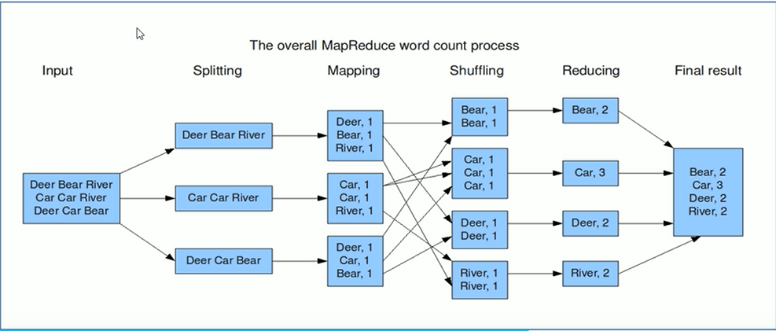
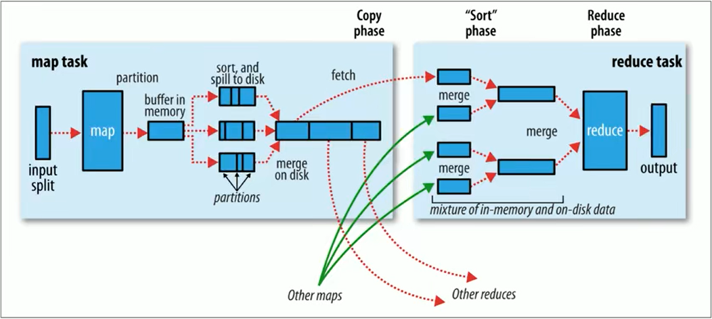

## MapReduce 基础
#### 基础
MapReduce 是一个分布式计算框架，用于编写应用程序处理大型集群中的海量数据。

一个完整的 MapReduce 程序在分布式运行时有三类实例进程：
* MRAppMaster：负责整个程序的过程调读和状态协调
* MapTask：负责 map 阶段的整个数据处理流程
* ReduceTask：负责 reduce 阶段的整个数据处理流程

经典的 WordCount 的 MapReduce 流程图如下：
其中的 Shuffing 阶段的目的是排序&分组，将所有 key 相同的数据聚合在一起。有多少种 Key 就有多少个 Reduce 程序参与到计算。

#### 如何区分 MapReduce 运行模式
MapReduce 有本地和 Yarn 两种运行模式。

* 方法一： 登录 Yarn 集群网页查看
* 方法二： 查看日志是否包含 local：`Running job:job_local31204124129_001`

#### MapReduce 输入输出

###### 输入
* 默认读取数据的组件是 FileInputFormat
* 关于输入路径：
  * 如果是一个文件，就处理该文件
  * 如果是一个目录，就将该目录下的所有文件作为一个整体来处理

## MapReduce 执行流程

#### Map 阶段执行过程
1. 把输入目录下的文件按照一定的标准进行逻辑切片，形成切片规划。默认 Split size = Block size，每一个切片由一个 MapTask 处理。
2. 对切片中的数据按照一定的规则读取，解析出 <key,value> 键值对。默认按行读取，可以设置解析类型。
3. Map 方法处理数据并输出
4. 按照一定的规则对 Map 输出的键值对进行分区（相同的 key 分为同一区），默认不分区，只有一个 ReduceTask。若分区的话分区的数量就是 ReduceTask 运行的数量。
5. Map 输出的数据写入内存缓冲区，达到一定比例溢出到磁盘上。`溢出的时候根据 key 进行排序，默认根据 key 字典排序`。
6. 对所有溢出文件进行最终合并，成为一个文件。
7. 对数据进行归约处理，也就是 reduce 处理。键相等的键值对会调用一次 reduce 方法。经过这一阶段，数据量会减少。归约后的数据输出到本地的文件中。
本阶段默认是没有的，需要用户自己增加这一阶段的代码。（慎用）

#### Reduce 阶段执行过程
1. ReduceTask 会主动从各个 MapTask 复制拉取其输出的键值对，`并将数据合并&排序`。
2. 对排序后的键值对数据调用 reduce 方法，并将最终输出结果写入到 HDFS 中。

#### Combiner 规约
Combiner 的作用是对 map 端的输出先做一次局部聚合，目的是减少 ReduceTask 通过网络复制 MapTask 输出数据的数据量，从而达到提高 MapReduce 性能的目的。

Combiner 的本质就是 Reducer，Combiner 和 Reducer 的区别在于运行的位置。
Combiner 是在每一个 MapTask 所在的节点本地运行，是局部聚合。
Reducer 是对所有 MapTask 的输出结果计算，是全局聚合。

Combiner 默认是不开启的，需要开发者慎用。用的好能够提高程序性能，用不好会改变程序运行结果且不易发现。

#### shuffle 
MapReduce 确保每个 reducer 的输入都是按键排序的。对 mapper 的输出排序、然后传送到 reducer 的过程，称为shuffle。

