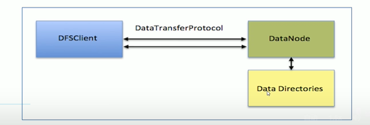
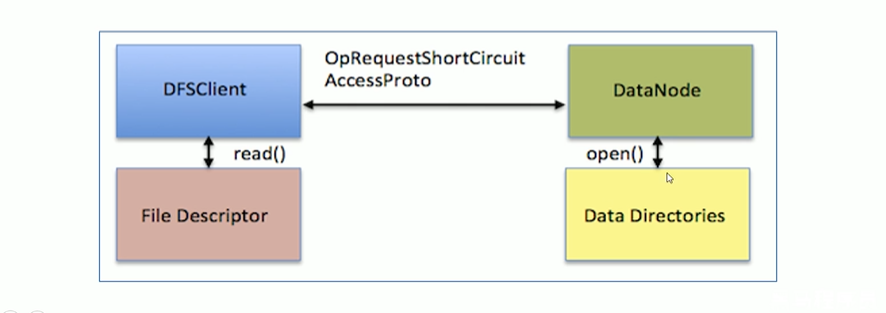
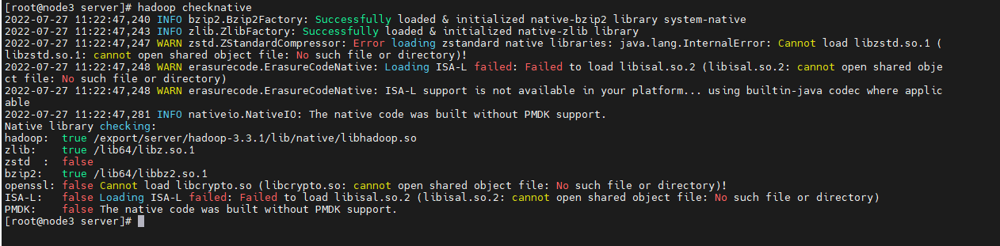
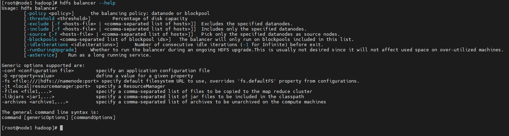
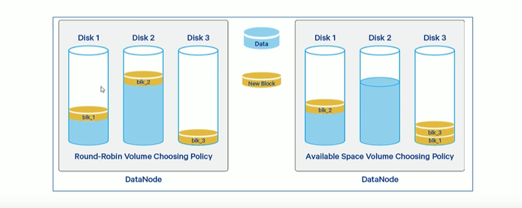
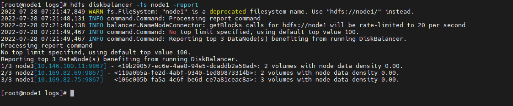

## HDFS 数据迁移方案
#### 数据迁移使用场景
* 冷热数据同步，分类存储  
  例如：将不常用的冷数据进行迁移
* 集群整体搬迁  
  例如：集群服务器资源紧张，将数据集体迁移到其它数据中心中
* 数据的准实时同步  
  数据的准实时同步目的在于实现数据的双备份可用。例如：当 A 集群突然宣告不再使用了，可以切换为 B 集群（备份），保障业务不会中断。

#### 数据迁移要考量的因素
1. 带宽  
   带宽用的多会影响线上业务，用的少数据同步速度较慢
2. 性能
3. 增量同步
   当 TB，PB 级别的数据需要同步时，如果每次都是以全量的方式同步数据，结果一定非常糟糕。如果仅针对增量数据进行同步是一个不错的选择。
   可以配合 HDFS 快照等技术实现增量数据同步
4. 数据迁移的同步性
   数据迁移的过程中需要保证周期内数据一定能够同步完成。例如：每周一同步一次数据，每次同步需要 20 天的时间，那么实际上同步周期不是 7 天而是 20 天。

#### HDFS 分布式拷贝工具：DistCp
DistCp 是 Hadoop 内置的工具，在 hadoop-tools 工程下。用于数据迁移，定时在集群之间和集群内部备份数据。 

## NameNode 安全模式
Hadoop 中的安全模式 safe mode 是 NameNode 的维护状态，在此维护状态下 NameNode 不允许对文件系统进行任何更改，不过可以接受读数据请求。

在 NameNode 启动过程中，首先会从 fsimage 和 edits 日志文件中加载系统状态。然后等待 DataNode 汇报可用的 block 信息。在此期间，NameNode
保持安全状态。随着 DataNode 的 block 持续进行汇报，当整个系统达到安全标准时，HDFS 会自动离开安全模式。在 NameNode Web 页面能够显示安全模式
是开启还是关闭。

###### 安全模式自动离开核心配置（hdfs-site.xml/hdfs-default.xml）  

| name | default value | description                                                                                                |
| --- |---------------|------------------------------------------------------------------------------------------------------------|
| dfs.namenode.safemode.threshold-pct | 0.999f        | 所有 DataNode 向 NameNode 已汇报信息的 block 数量占所有 block 数量的百分比。<br/>小于等于 0 表示退出安全模式时不需要考虑该百分比 <br/>大于 1 表示安全模式永久生效 |
| dfs.namenode.safemode.min.datanodes | 	0            | 退出安全模式之前，必须存活的 DataNode 数量                                                                                 |
| dfs.namenode.safemode.extension | 30000         | 满足退出安全模式条件之后，还需要等待多少时间才能够退出安全模式                                                                            |

###### 安全模式手动进入/离开
* 进入（开启）安全模式命令
> hdfs dfsadmin -safemode enter/leave  
> 手动进入安全模式对于集群维护或升级非常有用，因为此时 HDFS 是只读的。

## HDFS 高阶优化方案
#### 短路本地读取
在 HDFS 中，读取数据的客户端 DFSClient 读取数据有两种情况，第一种情况是 DFSClient 和要读取的数据在同一个机器上，此时读取数据相当于本地读取。
第二种情况是 DFSClient 和要读取的数据不在同一个机器上需要跨网络读取，此时读取数据相当于 remote 远程读取。然而不论是哪种方式，读取数据的流程都是一样的。
如下图所示，DFSClient 先请求 DataNode，然后 DataNode 获取到数据通过 RPC 协议将数据返回给 DFSClient。
  
可以看出，当 DFSClient 读取本地的数据时，仍然需要借助 DataNode 进行中转，此时性能肯定会受到影响。短路本地读取指的是在本地读取这种情况下，
DFSClient 能够绕过 DataNode 直接读取数据。

###### 短路本地读取实现方式
借助 Unix Domain Socket(是一种进程间通讯方式)，使得同一台机器的 2 个进程之间能够通过 Socket 进行通讯，并且允许在进行间传递文件描述符。
  
如上图所示，当 DFSClient 需要读取数据时先请求 DataNode，由 DataNode 从文件目录中获取文件的描述符并将其发送给 DFSClient。然后 DFSClient 通过这个文件描述符
再去直接读取文件。

###### 配置短路本地读取
1. 安装 libhadoop.so  
   因为 java 不能直接操作 Unix Domain Socket，所以需要安装 Hadoop 的 native 包 libhadoop.so。在编译 Hadoop 源码的时候可以通过编译 native
   模块获取。可以用`hadoop checknative`查看 native 包是否安装好
     

2. 配置 hdfs-site.xml

| name | default value | description                                                                               |
| --- |---|-------------------------------------------------------------------------------------------|
| dfs.client.read.shortcircuit | false  | 是否打开短路本地读取                                                                                |
| dfs.domain.socket.path |  | DFSClient 和 DataNode 之间沟通的 Socket 本地文件路径（需要先手工创建好，只需要创建路径即可，但是 value 包含路径下的 dn_socket 文件） |

#### Block 负载平衡器：Balancer
###### 背景
HDFS 中的数据并不总是均匀分布在各个 DataNode 上，一个常见的原因是向现有集群中添加了一个新的 DataNode。HDFS 提供了一个 Balancer 程序能够分析
集群中所有的 Block 放置信息并且在集群中所有的 DataNode 节点之间平衡数据。需要注意的是，Balancer 无法平衡单个 DataNode 中的各个卷（磁盘） 

HDFS 中所谓的平衡数据指的是每个 DataNode 的磁盘空间利用率（本机已用空间/本机总容量）与整个集群空间利用率（HDFS 集群已使用空间/HDFS 集群总容量）
之间相差不超过给定阈值百分比。

###### Balancer 相关命令

> * -threshold 10：集群平衡条件阈值，区间选择 0-100
> * -policy datanode：集群平衡策略可选 datanode（默认） 或 blockpool
> * -exclude -f /tmp/p1.txt：默认为空，指定该部分 ip 不参与 balance，-f 指定输入为文件
> * -include -f /tmp/p1.txt：默认为空，只允许该部分 ip 不参与 balance，-f 指定输入为文件
> * -idleiterations：退出前的空闲迭代次数

###### 如何运行 Balancer
* step 1：设置平衡数据的传输带宽
> hdfs dfsadmin -setBalancerBandwidth newbandwidth 
> newbandwidth 指的是为每个 NataNode 配置的可以使用的最大网络带宽量，以字节数为单位。

* step 2：运行 Balancer
> 例如指定阈值运行：hdfs balancer -threshold 10。

#### 磁盘均衡器：HDFS Disk Balancer
###### 背景
相较于个人 PC，服务器能够挂载多个磁盘来扩充存储能力。在 HDFS 中 DataNode 负责将新的数据块存储到本地的哪个磁盘上，当写入新 block 
时，DataNode 有两种数据存储策略来选择将数据存储到哪个磁盘上：循环策略和可用空间策略。

对于循环策略来说，它会将新的 block 轮流的均匀分布在可用磁盘上，默认使用此策略。它的缺点是当新添加了一个磁盘时，使用此策略使得旧的磁盘中数据很多，
而新的磁盘数据量少。不能很好的负载均衡。

对于可用空间策略来说，它会评估各个磁盘的可用空间，优先将新的 block 存储到可用空间大的磁盘上。它的缺点是当机器上大部分磁盘的可用空间都不足的前提下，
新添加了一个磁盘时，所有的新的 block 都会存储到新的磁盘上，而此时其它磁盘都处于空闲状态。此时系统的写入效率很低，因为仅仅依赖新的磁盘的 IO。



###### 数据传播报告
为了衡量出集群中哪个机器遭受到了数据不平衡，磁盘平衡器定义了卷数据密度和节点数据密度：
* 卷数据密度：比较同台机器上不同卷之间的数据分布情况
* 节点数据密度：比较集群中不同机器的数据分布情况

当某个 DataNode 进行磁盘数据均衡，就可以先计算或读取当前机器的卷数据密度，有了这些信息就可以知道哪些卷已超量配置，哪些卷已不足。

###### HDFS Disk Balancer 工作方式
HDFS Disk Balancer 通过创建计划进行操作，该计划是一组语句，描述应在两个磁盘之间移动多少数据，然后在 DataNode 上执行该语句。计划包含多个移动步骤。
计划中每个移动步骤都具有目标磁盘，源磁盘地址，要移动的字节数。Hadoop 默认开启该功能。

###### HDFS Disk Balancer 相关命令
1. 生成 plan 计划
>  hdfs diskbalancer -plan node1 
> * -out：计划文件输出位置
> * -bandwidth：设置运行 Disk Balancer 的最大带宽，默认为 10MB/S
> * -thresholdPercentage：磁盘数据能够进行平衡的阈值，默认为 10%
> * -maxerror：指定磁盘平衡时可忽略的最大错误数
> * -v：显示详细信息
> * -fs：指定要使用的 NameNode，如果未指定则使用配置中默认的 NameNode

2. 执行计划
>  hdfs diskbalancer -execute <JSON file path>

3. 查询
>  hdfs diskbalancer -query datanode1
> 从运行计划的 DataNode 中获取 Disk Balancer 当前状态

4. 取消操作
>  hdfs diskbalancer -cancel <JSON file path>
>  hdfs diskbalancer -cancel planId node1

5. 汇报
>  hdfs diskbalancer -fs hdfs://name_node_host:8020 -report  


#### 纠删码技术：Erasure Coding
###### 背景
为了提供容错能力，HDFS 会根据复制因子在不同的 DataNode 上复制文件块。默认复制因子为 3，会复制出 2 个副本出来，加上原始的文件块总共有 3 个相同的
副本。因此会多使用 200% 的存储开销，网络带宽也会相应的增加。

为了提高集群存储效率，使用了纠删码技术。

###### Erasure Coding 介绍
Erasure Coding 是一种编码容错技术。最早用于通讯行业，数据传输中的数据恢复。它通过对数据进行分块，然后计算出校验数据，使得各个部分的数据产生关联性。
当一部分数据块丢失时，可以通过剩余的数据块和校验块计算出丢失的数据块。

#### 动态节点管理
###### 节点上线
参考搭建 Hadoop 集群

###### 节点下线
step1:  
在 NameNode 机器的 hdfs-site.xml 中配置 dfs.hosts.exclude 属性，该属性的值指向的文件是 HDFS 的黑名单，会被集群排除在外。需要注意的是该配置
需要在搭建集群的时候就配置好，配置一个空的目录。否则就需要重启 NameNode 才能加载该属性。

注意：如果副本数为 3，退役后剩余的节点数小于 3，那么是不能成功退役的。需要修改副本数后才能退役。
```
<property>
	<name>dfs.hosts.exclude</name>
	<value>/export/server/excludes</value>
</property>
```

step2: 
在 NameNode 所在机器刷新节点：
> hdfs dfsadmin -refreshNodes

 等待节点状态为 Decommissioned 即可。

###### 白名单
白名单指的是允许哪些机器可以加入到当前 HDFS 集群中，是一种准入机制。白名单由 hdfs-site.xml 中的 dfs.hosts 控制，默认值为空表示允许所有主机加入集群。

###### 黑名单
黑名单指的是不允许哪些机器可以加入到当前 HDFS 集群中，是一种禁入机制。黑名单由 hdfs-site.xml 中的 dfs.hosts.exclude 控制，默认值为空不禁止任何主机加入。

#### HDFS HA 解决方案：QJM（todo 需要学习 zookeeper）
#### NameNode 联邦机制
###### 当前 HDFS 体系架构局限性
当前 HDFS 体系结构仅允许单个 NameNode 维护文件系统命名空间。这种体系目前存在一些弊端和局限性：
1. DataNode 磁盘存储空间不足可以横向扩展即添加节点，但是当 NameNode 内存不足时并不支持横向扩展，只能纵向加内存。然而内存并不是可以无限增加的。
2. 对文件系统的任何操作都依赖与 NameNode。因此，集群的性能取决于 NameNode 的吞吐量。
3. 因为只有一个 NameNode，所以只有一个命名空间。不方便对不同的路径进行隔离（权限管理）

######  NameNode 联邦机制介绍
NameNode 联邦机制可以解决上述问题。集群中可以有多个 NameNode，每一个 NameNode 互不相同有各自的 NameSpace。多个 NameSpace 之间相互独立
且不需要互相协调，各自分工，管理好自己的区域，它们共享同一个 DataName 集群。每个 DataNode 要向集群中所有的 NameNode 注册，且周期性地向所有
NameNode 发送心跳和块报告，并执行来自所有 NameNode 的命令。

######  NameNode 联邦机制的好处
1. 可以水平扩展命名空间
2. 提高集群的吞吐量
3. 可以有效的对不同的 NameSpace 进行隔离

#### HDFS 集群滚动升级
###### 非联邦 HA 集群滚动升级
在 HA 集群中有多个 NameNode（主备模式），DataNode，JournalNode，ZookeeperNode。滚动升级过程中，一般仅针对 NameNode 和 DataNode 进行升级。升级
JournalNode 和 ZookeeperNode 可能会导致集群停机。

假设要升级的 HDFS 集群中有 2 个 NameNode 分别为 NN1 和 NN2。其中 NN1 处于 Active，NN2 处于 StandBy 状态。
滚动升级步骤如下：
* step1: 滚动升级准备
> hdfs dfsadmin -rollingUpgrade prepare 
> 创建一个新的 fsimage 文件用于回滚
> 
> hdfs dfsadmin -rollingUpgrade query 
> 不断执行该命令查看回滚 fsimage 是否已经创建完成（如果显示 Proceeding with Rolling Upgrade 表示已经完成）

* step2: 升级 Active NN 和 StandBy NN(先升级备，再升级主)
> hdfs -daemon stop NN2 
> 关闭 NN2
> 
> hdfs -daemon start NN2 rollingUpgrade started
> 升级 NN2
> 
> hdfs -daemon stop NN1
> 停止处于 Active 状态的 NN1，进行一次故障转移使得升级之后的 NN2 状态变为 Active。
> 
> hdfs -daemon start NN1 rollingUpgrade started
> 升级 NN1

* step3: 升级 DataNode
> hdfs dfsadmin -shutdownDatanode <DATANODE_HOST:IPC_PORT> upgrade  
> 选择集群中的一部分 DataNode 进行升级。（比如可以根据机架来筛选）
> IPC_PORT 由参数 dfs.datanode.ipc.address 指定，默认为 9867  
> 
> hdfs dfsadmin -getDatanodeInfo <DATANODE_HOST:IPC_PORT>  
> 检查下线的 DataNode 是否已经停止服务，如果还能得到节点信息说明节点还未真正被关闭。
> 
> hdfs --daemon start datanode  
> 对选中的所有 DataNode 节点执行以山操作使其上线

* step4：完成滚动升级
> hdfs -daemon -rollingUpgrade finalize

###### 联邦 HA 集群滚动升级
联邦集群是拥有多个 NameSpace 的集群，每个 NameSpace 对应一主一备多个 NameNode 节点。也称为联邦+HA集群。

联邦集群的升级过程与非联邦集群升级过程比较相似，只是需要为不同的 NameNode 多执行几次升级步骤即可。

#### HDFS 集群的降级和回滚
###### 降级和回滚的区别
* 共同点
1. 都会将版本回退到升级前的版本
2. 在升价的 finalize 命令执行完成之后，将不再允许降级和回滚
* 不同点
1. 降级能支持滚动降级即不需要停止服务。而回滚需要停止服务一段时间
2. 降级会保留用户现有的数据，而回滚不仅会将版本回退到之前的版本，也会将数据回退到升级前的状态

###### HA 集群降级
降级时必须先降级 DataNode 再降级 NameDode。因为新版本一般在协议，API 等都是兼容老版本的，如果先降级 NameNode，此时 NameNode 是旧版本，
DataNode 是新版本二者协议等可能会不兼容。

* step1: 降级 DataNode
> hdfs dfsadmin -shutdownDatanode <DATANODE_HOST:IPC_PORT> upgrade  
> 选择集群中的一部分 DataNode 进行降级操作。（比如可以根据机架来筛选）  
> IPC_PORT 由参数 dfs.datanode.ipc.address 指定，默认为 9867  
>
> hdfs dfsadmin -getDatanodeInfo <DATANODE_HOST:IPC_PORT>    
> 检查下线的 DataNode 是否已经停止服务，如果还能得到节点信息说明节点还未真正被关闭。  

* step2: 降级主备 NameDode
> 停止->降级->启动 StandBy NameNode  
> 停止->降级->启动 原来的 ACTIVE NameNode（触发故障转移，使得主备角色互换）  
> hdfs -daemon -rollingUpgrade finalize 确认完成降级操作

###### HA 集群回滚
步骤：
1. 停止所有的 DataNode 和 NameNode
2. 在所有机器上恢复升级前的软件版本
3. 在 NN1 节点上执行 -rollingUpgrade rollback 命令来启动 NN1，将 NN1 作为 ACTIVE 节点
4. 在 NN2 节点上执行 -bootstrapStandBy 命令并正常启动 NN2，将 NN2 作为 StandBy 节点
5. 以 -rollback 参数启动所有的 DataNode