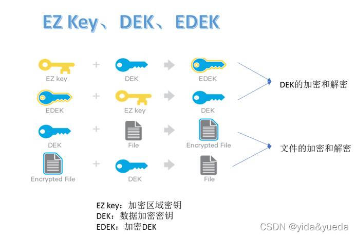
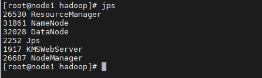

## Trash 回收站
HDFS Trash 机制类似于 windows 的回收站。HDFS 默认不开启该功能，开启后所有被删除的文件都会移动到 Current 目录中（/user/
${username}/.Trash/current）。回收站的文件可以配置存在多久后被永久删除。也可以将回收站的文件移动来其它地方来恢复文件。

#### Trash Checkpoint
检查点仅仅是用户回收站下的一个目录，用于存储在创建检查点之前删除的所有文件或目录。也就是说创建检查点的作用就是可以将回收站的文件或目录全部移动到检查点目录下，
便于查看。如果想查看回收站目录，可以在 /user/${username}/.Trash/{timestamp_of_checkpoint_creation} 处看到。

#### 开启 Trash 功能
HDFS 默认是不开启 Trash 功能的，如果要开启 Trash 功能，需要在 core-site.xml 中配置以下两个相关参数：
> fs.trash.interval （默认值是0）  
> 表示回收站的文件多少分钟后会被删除。如果为 0 表示被禁用
> 
> fs.trash.checkpoint.interval （默认值是0）  
> 两次 trash checkpoint 之间的分钟间隔，这个值应该被设置为小于等于 fs.trash.interval 的值。
> 如果配置项为0，那么这个配置项的值会被设置为 fs.trash.interval 的值。 checkpointer 线程每次运行的时候，
> 都会对 Trash 目录中的 current 目录创建一个 checkpoint（其实是重命名已删除的文件操作），并把在 fs.trash.interval 分钟之前创建的 checkpoint 删除掉。

#### 删除文件跳过 Trash
> hadoop fs -rm -skipTrash /test/HA

#### 从 Trash 中恢复文件
可以用 hadoop fs -cp [-f] 或 hadoop fs -mv 等命令把回收站的文件移动出来即可恢复

#### 清空 Trash
> hadoop fs -expunge

## Snapshot 快照
#### 指定目录开启快照功能
HDFS 可以对整个文件系统或某个目录创建快照，但是创建快照的前提是相应的目录开启快照功能
> hdfs dfsadmin -allowSnapshot /dir_path

#### 指定目录禁用快照功能
禁用快照功能的前提是该目录的所有快照已被删除
> hdfs dfsadmin -disallowSnapshot /dir_path

#### 快照相关其它命令
* createSnapshot
* deleteSnapshot
* renameSnapshot
* lsSnapshottableDir：列出可以快照的目录列表
* snapshotDiff：获取快照差异报告

## HDFS 权限管理
#### UGO 权限管理
HDFS 权限系统与 Linux 系统的 UGO 模型类似，简单描述为：每个文件和目录都与一个拥有者和一个组相关联。
HDFS 文件权限分为：读权限（r），写权限（w），执行权限（x）

下图中`-`代表它是一个文件，`d`代表它是一个目录


对于文件：需要`r`权限才能读取，需要`w`权限才能写入或追加。没有`x`可执行文件的概念。  
对于目录：需要`r`权限才能列出目录的内容，需要`w`权限才能创建或删除文件。需要`x`权限才能访问目录的子集。

#### 修改权限命令
> hadoop fs -chmod 777 /test.zip

#### 用户身份认证
在 HDFS 中，用户身份认证独立于 HDFS 项目之外。也就是说 HDFS 不负责用户身份合法性检查,用户是否合法取决于集群的认证体系。目前社区支持两种身份认证：
Simple 和 Kerberos。

###### Simple（默认）
Simple 权限控制是基于操作系统的权限控制。用户只要能登录上服务器，那么这个用户就可以操作 HDFS。
当客户端和 NameNode 交互时，会将服务器的用户名传递给 NameNode。客户端传的是什么，HDFS 无条件信任并执行相关 CRUD 操作。

因此默认情况下，如下代码就可以操作 HDFS：
> System.setProperty("HADOOP_USER_NAME", "root");

###### Kerberos

#### ACL 权限管理
ACL 是 Access Control List（访问控制列表） 的缩写，ACL 提供了一种方法，可以为特定的用户或组设置不同的权限，而不仅仅是文件的所有者和文件的组。

###### 开启 ACL
1. 在 hdfs-site.xml 中设置 dfs.namenode.acls.enable=true
2. 重启 HDFS 集群

###### 显示文件和目录的 ACL 信息
> hadoop fs -getfacl [-R] <path>

###### 设置文件和目录的 ACL
> `hadoop fs -setfacl [-R] [-b|-k -m|-x <acl_spec> <path>]|[--set <acl_spec> <path>]`
> * `<path>`: 需要设置ACLs的文件或者目录的路径。
> * -R: 以递归方式将操作应用于所有文件和目录。
> * -b: 撤回基本ACL条目以外的所有条目。保留用户，组和其他条目以与权限位兼容。
> * -k: 移除default ACL。
> * -m: 修改ACL。新条目将添加到ACL，并保留现有条目。不会影响已有的权限。
> * -x: 仅移除指定的ACL。
> * `<acl_spec>`: 逗号分隔的ACL权限。
> * --set: 完全替换ACL，丢弃所有现有条目。 acl_spec必须包含用户，组和其他条目，以便与权限位兼容。

###### ls 的输出将在带有 ACL 的任何文件或目录的权限字符串后附加一个 “+” 字符
> hadoop fs -ls <args>

#### ProxyUser
比如普通用户 barney 想要访问 HDFS 但是它没有权限，它就找具有 Kerberos 凭证的 root 用户来代理它访问 HDFS 执行操作。

在Hadoop的用户认证机制中，如果使用的是Simple认证机制，实际上ProxyUser的使用意义并不大，因为客户端本身就可以使用任意用 户对服务端进行访问，服务端并不会做认证。
而在使用了安全认证机制（例如 Kerberos）的情况下，ProxyUser认证机制就很有作用：
1. 用户的管理会比较繁琐，每增加一个新的用户，都需要维护相应的认证信息（kerberosKeyTab），使用ProxyUser的话，只需要维护少量superuser的认证信息，而新增用户只需要添加 proxyuser 即可，proxyuser 本身不需要认证信息。
2. 通常的安全认证方式，适合场景是不同用户在不同的客户端上提交对集群的访问；而实际应用中，通常有第三方用户平台或系统会统一用户对集群的访问，并且执行一系列任务调度逻辑，
   例如 Oozie、华为的 BDI 系统等。此时访问集群提交任务的实际只有一个客户端。使用 ProxyUser 机制，则可以在这一个客户端上，实现多个用户对集群的访问。

## HDFS 透明加密
HDFS 实现了透明的、端到端的加密。配置完成后，读取和写入特殊 HDFS 目录的数据将被透明地加密和解密，而无需更改用户应用程序代码。
这种加密也是端到端的，这意味着数据只能由客户端进行加密和解密。HDFS 从不存储或访问未加密的数据或未加密的数据加密密钥。
这满足了加密的两个典型要求：静态加密（意味着数据在持久性介质上，例如磁盘）以及传输中加密（例如，当数据通过网络传输时）。

###### 加密区域及密钥
加密区域是 HDFS 上的一个特殊目录，写入文件时会透明的加密，读取文件时会透明的解密。

当一个加密区域被创建时，会有一个`加密区域密钥`（EZ 密钥，encryption zone key）与之对应，它存储在 HDFS 外部的 keystore 中。加密区域里面的每一个
文件都有其自己的加密密钥，叫做`数据加密密钥`（DEK，data encryption key）。`数据加密密钥`被`加密区域密钥`加密生成`加密数据加密密钥`（EDEK）



###### KMS
大多数密钥库（keystore）都不是为 Hadoop 加密解密所设计的，因此 HDFS 使用 KMS（密钥管理服务器，Key Management Serve）来操作 keystore。

KMS主要功能：1. 访问加密区域密钥（EZ key） 2. 生成 EDEK，EDEK 存储在 NameNode 上 3. 为 HDFS 客户端解密 EDEK

###### 写入加密文件过程


###### KMS 配置

**step 1:关闭 HDFS 集群**  
在 NameNode 上执行 `stop-dfs.sh`

**step 2:创建 keystore**  
`keytool -genkey -alias 'test-keystore'`

**step 3:在 Hadoop 配置文件目录下创建存储 keystore 密码的文件**  
`touch kms.keystore.password``

**step 4:配置 kms-site.xml**  
```xml
<configuration>
  <property>
     <name>hadoop.kms.key.provider.uri</name>
     <value>jceks://file@/${user.home}/kms.jks</value>
  </property>
  <property>
    <name>hadoop.security.keystore.java-keystore-provider.password-file</name>
    <value>kms.keystore.password</value>
  </property>
  <property>
    <name>dfs.encryption.key.provider.uri</name>
    <value>kms://http@node1:16000/kms</value>
  </property>
    <property>
    <name>hadoop.kms.authentication.type</name>
    <value>simple</value>
  </property>
</configuration>
```

**step 5:配置 kms-env.sh**  
```text
export KMS_LOG=${KMS_HOME}/logs/kms
export KMS_HTTP_PORT=16000
export KMS_HOME=/export/server/hadoop-3.3.1/
export KMS_ADMIN_PORT=16001
```

**step 6:配置 core-site.xml**  
```xml
<property>
   <name>hadoop.security.key.provider.path</name>
   <value>kms://http@node1:16000/kms</value>
</property>

```

**step 7:配置 hdfs-site.xml**  
```xml
 <property>
     <name>dfs.encryption.key.provider.uri</name>
     <value>kms://http@node1:16000/kms</value>
 </property>

```

**step 8:将配置文件复制到所有的服务器上**  
在`/export/server/hadoop-3.3.1/etc/hadoop`目录下执行
`scp kms-site.xml kms-env.sh core-site.xml hdfs-site.xml node2:$pwd`

**step 9:启动 HDFS 集群**  
在 NameNode 上执行 `start-dfs.sh`

**step 10:启动 KMS**  
`hadoop --daemon start kms`

查看是否启动成功：  


###### 创建加密区
**step 1:创建 key**  
创建的 key 用于后面创建加密空间时，指定加密空间的 EZ key  
`hadoop key create ezk`

查看刚才创建的 key
`hadoop key list -metadata`

**step 2:创建加密区**
```text
hadoop fs -mkdir /zone
hdfs crypto -createZone -keyName ezk -path /zone
```